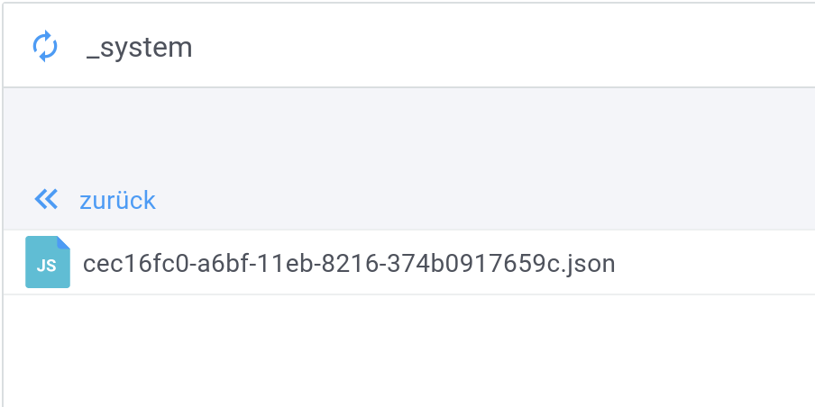

# Plugin deinstallation

When a plugin is installed Ladon creates a file in the *_system* bucket under the path:
```bash
/_system/etc/plugins/....
```



For every installation there will be another file.

You can downgrade to the previous one by deleting the most recently created file.
Deleting of this file also removes all plugin artefacts together with it.
