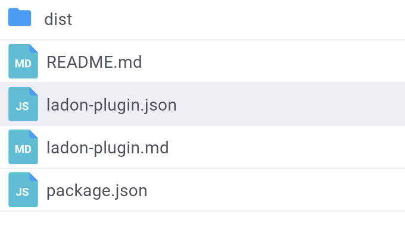
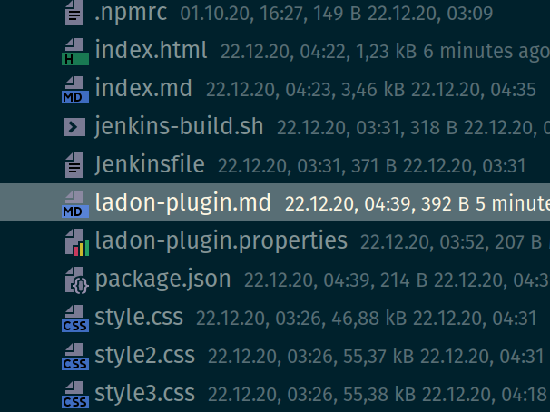

# Plugin requirements
Here are the things you have to know about the plugin structure

#### UI / Static Web Plugins

There are 2 configuration files in your web project where you can configure your plugin and deployment:

* ladon-plugin.json   
  

Here you can define different properties like the destination where to deploy your static web files in.
```json
 {
   "$schema": "https://plugins.mind-consulting.de/plugin-def-1.0.0.schema.json",
   "id": "mind/mf-ladon-share",
   "name": "Ladon Share Manager",
   "shortText": "",
   "deployTarget": "/_ui/root/core-mf/mf-ladon-share",
   "descriptionFile": "ladon-plugin.md",
   "type": "static-web",
   "category": ["ui"],
   "vendor": {
     "name": "Mind Consulting UG",
     "url": "https://mind-consulting.de"
   }
 }

```

and optional
* ladon-plugin.md    
  

Here you can add information to be shown on the plugin download page.
If not available and a README.md is present it will be used instead.

This is all you need to make your plugin available for the Ladon-Plugin-Service to find it after you package and publish your project to nexus.
